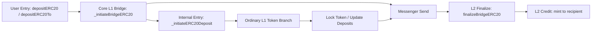

# Deposit Review

## Flow



`L1 -> L2 messenger delivery segment` is shown here only as the transport segment of the full deposit path. Messenger / portal internals are outside my current review scope.

## 1. L1StandardBridge.depositERC20(...)

```solidity
function depositERC20(
    address _l1Token,
    address _l2Token,
    uint256 _amount,
    uint32 _minGasLimit,
    bytes calldata _extraData
)
    external
    virtual
    onlyEOA
{
    _initiateERC20Deposit(_l1Token, _l2Token, msg.sender, msg.sender, _amount, _minGasLimit, _extraData);
}
```

What it does:

- starts the direct self-deposit path
- keeps the caller as both source and destination
- forwards the deposit intent into the internal ERC20 path

Invariants:

- the direct deposit path must be restricted to `EOA` callers
- the self-deposit path must preserve caller semantics: the caller must remain both sender and recipient
- `depositERC20(...)` must forward the declared token pair and deposit parameters into the internal ERC20 path without rewriting them

## 2. L1StandardBridge.depositERC20To(...)

```solidity
function depositERC20To(
    address _l1Token,
    address _l2Token,
    address _to,
    uint256 _amount,
    uint32 _minGasLimit,
    bytes calldata _extraData
)
    external
    virtual
{
    _initiateERC20Deposit(_l1Token, _l2Token, msg.sender, _to, _amount, _minGasLimit, _extraData);
}
```

What it does:

- starts the generalized deposit path
- keeps the caller as source
- preserves `_to` as the explicit destination

Invariants:

- the `deposit-to` path must preserve `caller` as source and `_to` as explicit destination
- `depositERC20To(...)` must forward the declared token pair and deposit parameters into the internal ERC20 path without rewriting them

## 3. L1StandardBridge._initiateERC20Deposit(...)

```solidity
function _initiateERC20Deposit(
    address _l1Token,
    address _l2Token,
    address _from,
    address _to,
    uint256 _amount,
    uint32 _minGasLimit,
    bytes memory _extraData
)
    internal
{
    _initiateBridgeERC20(_l1Token, _l2Token, _from, _to, _amount, _minGasLimit, _extraData);
}
```

What it does:

- converges the external ERC20 deposit entrypoints into one internal handoff
- forwards the prepared deposit semantics into the core bridge function

Invariants:

- `_initiateERC20Deposit(...)` must converge the external ERC20 deposit path into a single core bridge path

## 4. StandardBridge._initiateBridgeERC20(...)

```solidity
function _initiateBridgeERC20(
    address _localToken,
    address _remoteToken,
    address _from,
    address _to,
    uint256 _amount,
    uint32 _minGasLimit,
    bytes memory _extraData
)
    internal
{
    require(msg.value == 0, "StandardBridge: cannot send value");

    if (_isOptimismMintableERC20(_localToken)) {
        require(
            _isCorrectTokenPair(_localToken, _remoteToken),
            "StandardBridge: wrong remote token for Optimism Mintable ERC20 local token"
        );

        IOptimismMintableERC20(_localToken).burn(_from, _amount);
    } else {
        IERC20(_localToken).safeTransferFrom(_from, address(this), _amount);
        deposits[_localToken][_remoteToken] = deposits[_localToken][_remoteToken] + _amount;
    }

    _emitERC20BridgeInitiated(_localToken, _remoteToken, _from, _to, _amount, _extraData);

    messenger.sendMessage({
        _target: address(otherBridge),
        _message: abi.encodeWithSelector(
            this.finalizeBridgeERC20.selector,
            _remoteToken,
            _localToken,
            _from,
            _to,
            _amount,
            _extraData
        ),
        _minGasLimit: _minGasLimit
    });
}
```

What it does:

- rejects `ETH value` in the ERC20 path
- splits the path into `mintable` and `ordinary` accounting branches
- completes source-side accounting
- emits the initiated event
- sends the cross-domain message to the counterpart bridge

Invariants:

- the ERC20 bridge initiation path must not accept `ETH value`
- the `mintable local token` path must confirm the correct `local/remote token pair` before `burn`
- the `mintable local token` path must complete source-side accounting via `burn`, not `escrow`
- the ordinary ERC20 path must complete source-side accounting via `transfer-in` and internal deposit accounting
- the ERC20 bridge initiation must emit a bridge-initiated event with the same `token/from/to/amount` semantics that actually went into the message path
- the ERC20 bridge initiation must send a message only to the counterpart bridge
- the ERC20 bridge initiation must reverse `local/remote token arguments` when building the finalize payload for the remote-side context

## 5. StandardBridge.finalizeBridgeERC20(...)

```solidity
function finalizeBridgeERC20(
    address _localToken,
    address _remoteToken,
    address _from,
    address _to,
    uint256 _amount,
    bytes calldata _extraData
)
    public
    onlyOtherBridge
{
    require(paused() == false, "StandardBridge: paused");
    if (_isOptimismMintableERC20(_localToken)) {
        require(
            _isCorrectTokenPair(_localToken, _remoteToken),
            "StandardBridge: wrong remote token for Optimism Mintable ERC20 local token"
        );

        IOptimismMintableERC20(_localToken).mint(_to, _amount);
    } else {
        deposits[_localToken][_remoteToken] = deposits[_localToken][_remoteToken] - _amount;
        IERC20(_localToken).safeTransfer(_to, _amount);
    }

    _emitERC20BridgeFinalized(_localToken, _remoteToken, _from, _to, _amount, _extraData);
}
```

What it does:

- accepts the counterpart-gated finalize call
- blocks execution in the paused state
- splits the finalize path into `mintable` and `ordinary` delivery branches
- completes destination-side credit or release
- emits the finalized event

Invariants:

- the ERC20 finalize path must be restricted only to the counterpart bridge
- the ERC20 finalize path must not execute in the paused state
- the `mintable local token` finalize branch must confirm the correct `local/remote token pair` before `mint`
- the `mintable local token` finalize branch must complete destination-side credit via `mint`, not `release existing tokens`
- the ordinary token finalize branch must decrement internal deposit accounting before release
- the ordinary token finalize branch must complete destination-side delivery via `release existing tokens`, not `mint`
- the ERC20 finalize path must emit a bridge-finalized event with the same `token/from/to/amount` semantics as those that were actually finalized
