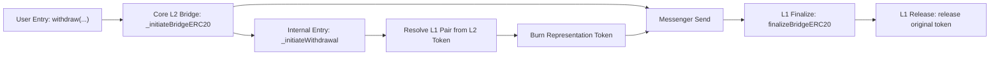

# Withdraw Review

## Flow



`L2 -> L1 messenger / portal delivery segment` is shown here only as the transport segment of the full withdraw path. Messenger / portal / proving internals are outside my current review scope.

## 1. L2StandardBridge.withdraw(...)

```solidity
function withdraw(
    address _l2Token,
    uint256 _amount,
    uint32 _minGasLimit,
    bytes calldata _extraData
)
    external
    payable
    virtual
    onlyEOA
{
    _initiateWithdrawal(_l2Token, msg.sender, msg.sender, _amount, _minGasLimit, _extraData);
}
```

What it does:

- starts the direct self-withdraw path
- keeps the caller as both source and destination
- forwards the withdraw intent into the internal path

Invariants:

- the direct withdraw path must be restricted to `EOA` callers
- the self-withdraw path must preserve caller semantics: the caller must remain both sender and recipient
- `withdraw(...)` must forward the declared token and withdraw parameters into the internal path without rewriting them

## 2. L2StandardBridge._initiateWithdrawal(...)

```solidity
function _initiateWithdrawal(
    address _l2Token,
    address _from,
    address _to,
    uint256 _amount,
    uint32 _minGasLimit,
    bytes memory _extraData
)
    internal
{
    if (_l2Token == Predeploys.LEGACY_ERC20_ETH) {
        _initiateBridgeETH(_from, _to, _amount, _minGasLimit, _extraData);
    } else {
        address l1Token = OptimismMintableERC20(_l2Token).l1Token();
        _initiateBridgeERC20(_l2Token, l1Token, _from, _to, _amount, _minGasLimit, _extraData);
    }
}
```

What it does:

- explicitly separates the `ETH` and `ERC20` paths
- derives the `L1` pair from the `L2` representation token in the non-ETH branch
- forwards the withdraw intent into the core bridge function

Invariants:

- the withdraw path must explicitly separate the `ETH` and `ERC20` models
- the non-ETH withdraw path must derive the `L1 token pair` from the `L2 token representation` itself
- the ERC20 withdraw handoff must pass `source`, `destination`, and withdraw parameters into the core bridge path without rewriting them

## 3. StandardBridge._initiateBridgeERC20(...)

```solidity
function _initiateBridgeERC20(
    address _localToken,
    address _remoteToken,
    address _from,
    address _to,
    uint256 _amount,
    uint32 _minGasLimit,
    bytes memory _extraData
)
    internal
{
    require(msg.value == 0, "StandardBridge: cannot send value");

    if (_isOptimismMintableERC20(_localToken)) {
        require(
            _isCorrectTokenPair(_localToken, _remoteToken),
            "StandardBridge: wrong remote token for Optimism Mintable ERC20 local token"
        );

        IOptimismMintableERC20(_localToken).burn(_from, _amount);
    } else {
        IERC20(_localToken).safeTransferFrom(_from, address(this), _amount);
        deposits[_localToken][_remoteToken] = deposits[_localToken][_remoteToken] + _amount;
    }

    _emitERC20BridgeInitiated(_localToken, _remoteToken, _from, _to, _amount, _extraData);

    messenger.sendMessage({
        _target: address(otherBridge),
        _message: abi.encodeWithSelector(
            this.finalizeBridgeERC20.selector,
            _remoteToken,
            _localToken,
            _from,
            _to,
            _amount,
            _extraData
        ),
        _minGasLimit: _minGasLimit
    });
}
```

What it does in the withdraw context:

- rejects `ETH value` in the ERC20 path
- usually sees the `representation token` on the standard `L2` withdraw path
- confirms pair correctness
- completes source-side `burn`
- sends the `L2 -> L1` message to the counterpart bridge

Invariants:

- the ERC20 bridge initiation path must not accept `ETH value`
- the `mintable local token` path must confirm the correct `local/remote token pair` before `burn`
- the `mintable local token` path must complete source-side accounting via `burn`, not `escrow`
- the ERC20 bridge initiation must send a message only to the counterpart bridge
- the ERC20 bridge initiation must reverse `local/remote token arguments` when building the finalize payload for the remote-side context

## 4. StandardBridge.finalizeBridgeERC20(...)

```solidity
function finalizeBridgeERC20(
    address _localToken,
    address _remoteToken,
    address _from,
    address _to,
    uint256 _amount,
    bytes calldata _extraData
)
    public
    onlyOtherBridge
{
    require(paused() == false, "StandardBridge: paused");
    if (_isOptimismMintableERC20(_localToken)) {
        require(
            _isCorrectTokenPair(_localToken, _remoteToken),
            "StandardBridge: wrong remote token for Optimism Mintable ERC20 local token"
        );

        IOptimismMintableERC20(_localToken).mint(_to, _amount);
    } else {
        deposits[_localToken][_remoteToken] = deposits[_localToken][_remoteToken] - _amount;
        IERC20(_localToken).safeTransfer(_to, _amount);
    }

    _emitERC20BridgeFinalized(_localToken, _remoteToken, _from, _to, _amount, _extraData);
}
```

What it does in the withdraw context:

- usually sees the ordinary/original `L1 token` on the standard `L2 -> L1` withdraw path
- decrements internal deposit accounting
- releases the existing locked original token
- emits the finalized event

Invariants:

- the ERC20 finalize path must be restricted only to the counterpart bridge
- the ERC20 finalize path must not execute in the paused state
- the ordinary token finalize branch must decrement internal deposit accounting before release
- the ordinary token finalize branch must complete destination-side delivery via `release existing tokens`, not `mint`
- the ERC20 finalize path must emit a bridge-finalized event with the same `token/from/to/amount` semantics that were actually finalized

## 5. L1StandardBridge.finalizeERC20Withdrawal(...)

```solidity
function finalizeERC20Withdrawal(
    address _l1Token,
    address _l2Token,
    address _from,
    address _to,
    uint256 _amount,
    bytes calldata _extraData
)
    external
{
    finalizeBridgeERC20(_l1Token, _l2Token, _from, _to, _amount, _extraData);
}
```

What it does:

- acts as a legacy/public wrapper
- forwards the withdrawal finalize semantics into the core finalize function

Invariants:

- `finalizeERC20Withdrawal(...)` must forward the withdrawal finalize semantics into `finalizeBridgeERC20(...)` without rewriting the arguments
